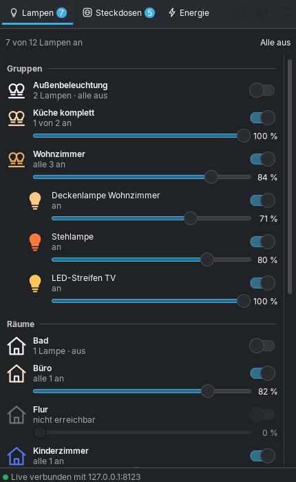
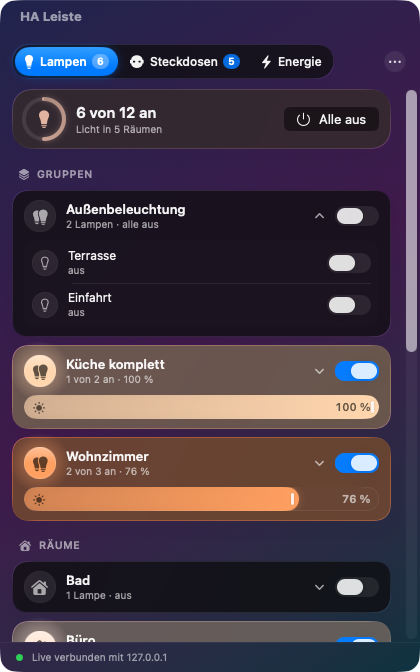
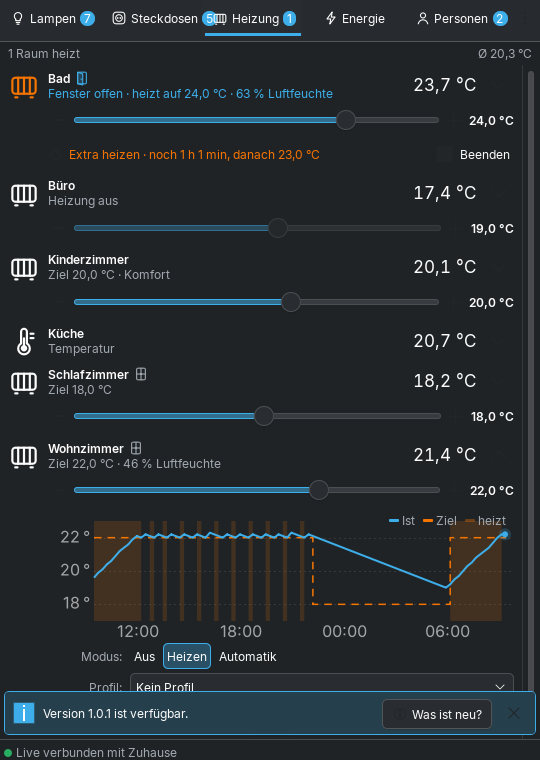
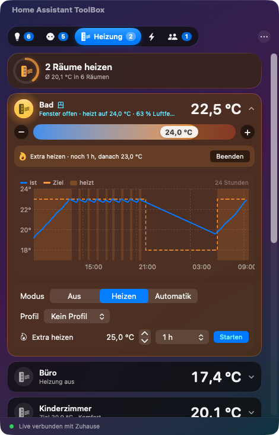
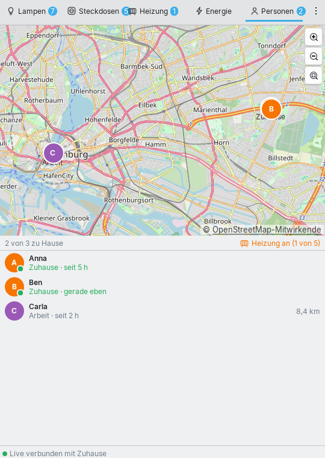
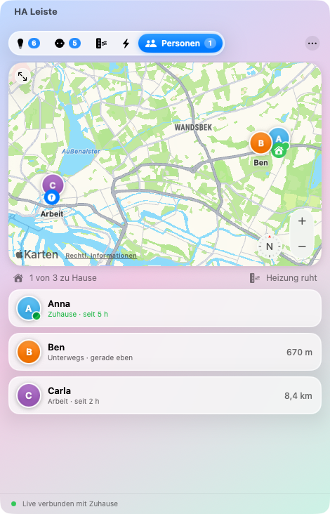
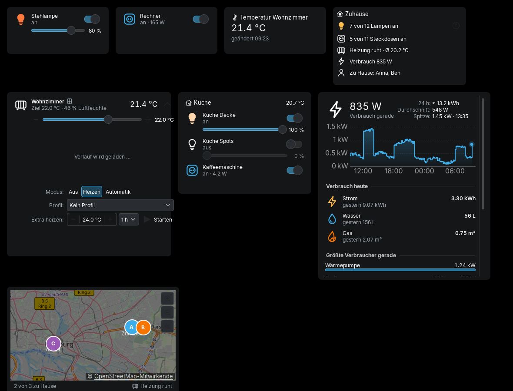
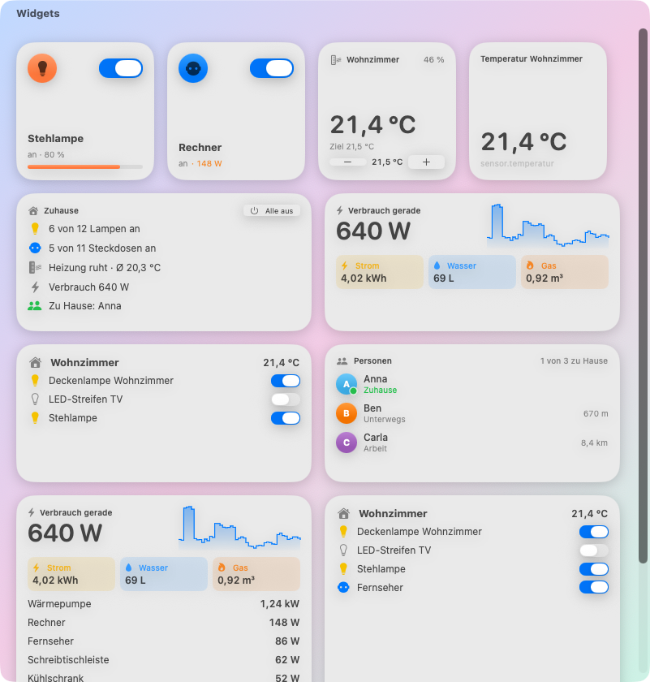

# Home Assistant Leiste – für KDE Plasma, macOS und iPhone

Lampen, Steckdosen und Energieverbrauch aus [Home Assistant](https://www.home-assistant.io/) mit einem Klick –
als **Plasma-Widget für KDE** (neben der Uhr, im Breeze-Look) und als **Menüleisten-App für macOS**
(im Liquid-Glass-Design von macOS 26). Beide können dasselbe; die Logik ist die gleiche.
Dazu gibt es **Widgets für den Schreibtisch** – und für **iPhone/iPad** eine Version für
[Scriptable](https://scriptable.app) mit Homebildschirm- und Sperrbildschirm-Widgets.

| KDE Plasma 6 | macOS |
|---|---|
|  |  |
|  |  |
|  |  |
|  |  |

## Was beide können

- **Lampen**: Gruppen und Räume zum Aufklappen, Schalter und Helligkeitsregler, Symbol in der Lampenfarbe, „Alle aus“
- **Steckdosen**: Steckdosenleisten und Schaltergruppen mit gemeinsamem Schalter und Verbrauch, einzelne Dosen nach Raum
- **Energie**: aktueller Verbrauch, Verlauf der letzten 24 Stunden, **Verbrauch heute** (Strom, Wasser, Gas),
  größte Verbraucher, Zählerstände
- **Heizung**: alle Räume mit Temperatur und Luftfeuchte, Zieltemperatur per Regler, Modus, Profil,
  **Extra heizen** für 30 Minuten bis 4 Stunden
- **Personen**: Karte wie bei „Wo ist?“, wer ist wo und wie weit weg, heizt es gerade?
- **Fenster offen/zu** bei jeder Heizung und **24-Stunden-Verlauf** (Ist, Ziel, Heizphasen) zum Aufklappen
- **Updates mit einem Klick**: neue Version wird gemeldet, „Was ist neu?“ zeigt die Änderungen
- **Mehrere Home-Assistant-Instanzen** mit Favorit, Wechsel über das Menü
- **Widgets/Kacheln** für den Schreibtisch: Übersicht, Lampe, Steckdose, Raum, Heizung, Energie, Personen, Entität
- **Live** über die WebSocket-Schnittstelle von Home Assistant, Schutz vor IP-Sperre bei falschem Token

## Herunterladen

Unter [Releases](https://github.com/Teyro/homeassistant-leiste/releases) liegen beide Programme:

| Datei | Für | Anleitung |
|---|---|---|
| `home-assistant.plasmoid` | KDE Plasma 6 (Manjaro, Arch, Fedora, Kubuntu …) | [plasma/README.md](plasma/README.md) |
| `HA-Leiste-x.y.z.zip` | macOS 14 oder neuer (Apple Silicon und Intel) | [macos/README.md](macos/README.md) |
| `HA-Leiste.js` | iPhone/iPad mit der App Scriptable | [ios/README.md](ios/README.md) |

Kurz:

```bash
# KDE (erstmals -i, Update -u)
kpackagetool6 -t Plasma/Applet -u home-assistant.plasmoid && plasmashell --replace &

# macOS: ZIP entpacken, „HA Leiste“ nach Programme ziehen, dann einmal
xattr -dr com.apple.quarantine "/Applications/HA Leiste.app"
```

## Aufbau

```
plasma/   KDE-Widget (QML, Plasma 6)
macos/    Mac-App (SwiftUI, Swift-Paket)
ios/      Skript für Scriptable (iOS) – wird aus der gemeinsamen Logik gebaut
test/     nachgebautes Home Assistant zum Testen (Token: test-token)
```

Der GitHub-Workflow prüft beide Programme, macht Bildschirmfotos der Mac-App auf macOS 26 und hängt bei
einem Tag `v*` beide Dateien an das Release.

## Lizenz

GPL-3.0-or-later
