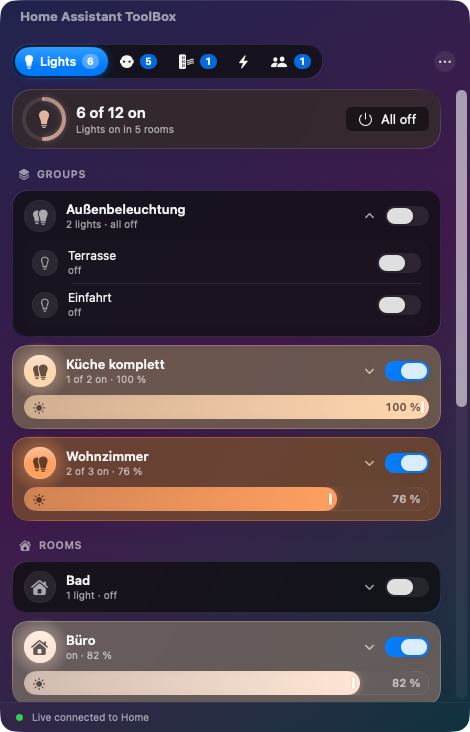
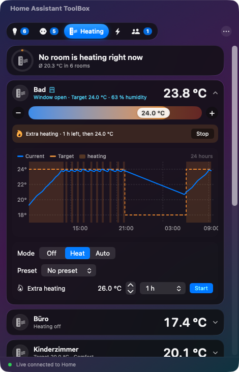

# Home Assistant ToolBox

**Your smart home one click away – in the KDE Plasma panel, the macOS menu bar and on your iPhone.**

Lights, sockets, heating, energy and people from [Home Assistant](https://www.home-assistant.io/), as a native
**KDE Plasma 6 widget** (Breeze look), a **macOS menu bar app** (Liquid Glass on macOS 26) and
**iPhone/iPad widgets** via [Scriptable](https://scriptable.app). All three share the same logic and the same features.

**Languages:** English · [Deutsch](README.de.md) · [中文](docs/README.zh.md) · [हिन्दी](docs/README.hi.md) ·
[Español](docs/README.es.md) · [العربية](docs/README.ar.md) · [Français](docs/README.fr.md) · [বাংলা](docs/README.bn.md)

| KDE Plasma 6 | macOS | iPhone |
|---|---|---|
|  |  |  |
|  |  |  |


## Features

- **Lights** – groups and rooms (Home Assistant areas) that expand, switch and brightness slider for every light,
  icons glow in the real light colour, “All off”
- **Sockets** – power strips and switch groups as one row with a shared switch and total consumption;
  device settings (LED, child lock, firmware …) are filtered out automatically
- **Energy** – current consumption, 24‑hour history, **today’s usage** of electricity, water and gas
  (taken from the Home Assistant energy dashboard), biggest consumers, meter readings
- **Heating** – every room with temperature and humidity, target temperature, mode, preset,
  **boost** for 30 minutes to 4 hours, **window open/closed** indicator and a **24‑hour chart**
- **People** – map with zones, who is where, since when and how far from home
- **Several Home Assistant instances** – e.g. home and holiday house, one marked as favourite
- **Desktop widgets / tiles** – overview, light, socket, room, heating, energy, people, any entity
- **Live updates** over the Home Assistant WebSocket API; stops asking on a wrong token so your IP is not banned
- **One‑click updates** with “What’s new?”
- **8 languages**: English, Deutsch, 中文, हिन्दी, Español, العربية (right‑to‑left), Français, বাংলা –
  chosen automatically from your system language

## Download

All files are on the [Releases page](https://github.com/Teyro/HomeAssistantToolBox/releases/latest):

| File | For | Guide |
|---|---|---|
| `homeassistant-toolbox.plasmoid` | KDE Plasma 6 (Arch, Manjaro, Fedora, openSUSE, Kubuntu, KDE neon …) | [plasma/README.md](plasma/README.md) |
| `HomeAssistantToolBox-macOS-x.y.z.zip` | macOS 14 or newer (Apple Silicon and Intel) | [macos/README.md](macos/README.md) |
| `HomeAssistantToolBox.js` | iPhone/iPad with the free app Scriptable | [ios/README.md](ios/README.md) |

Quick start:

```bash
# KDE Plasma 6 (first install -i, update -u)
kpackagetool6 -t Plasma/Applet -i homeassistant-toolbox.plasmoid
# then: right-click the panel → Add Widgets → “Home Assistant ToolBox”

# macOS: unzip, drag “Home Assistant ToolBox” to Applications, then once:
xattr -dr com.apple.quarantine "/Applications/Home Assistant ToolBox.app"
```

You need your Home Assistant address and a **long‑lived access token**
(Home Assistant → your profile (bottom left) → *Security* → *Long‑lived access tokens* → *Create token*).

## Privacy and security

- The apps talk **only to your own Home Assistant** – no cloud, no tracking, no analytics.
- Additional connections: GitHub (update check, can be switched off) and OpenStreetMap tiles for the people map.
- Tokens are stored in the **macOS Keychain** and the **iOS Keychain**. On KDE they are kept in the Plasma
  widget configuration and in `~/.config/homeassistanttoolbox/instanzen.json` (readable only by you).
- Updates are only accepted from this project’s GitHub releases; the Mac app also checks bundle ID and signature.
- If a token is lost, delete it in your Home Assistant profile (*Security* → *Long‑lived access tokens*).
- Found a security issue? Please see [SECURITY.md](SECURITY.md).

## Upgrading from “Home Assistant Leiste”

Home Assistant ToolBox is the successor of *Home Assistant Leiste*. Because the app IDs changed, the old version
does not update itself to the new one: install the new version once, your instances and settings are taken over
automatically (on the Mac, macOS may ask once whether the app may read the token from the keychain). Then remove
the old widget/app.

## Project layout

```
plasma/   KDE Plasma 6 widget (QML)
macos/    macOS app + widgets (SwiftUI, Swift package, XcodeGen)
ios/      Scriptable script – built from the shared logic (plasma/…/logik.js)
i18n/     translations (one JSON file per language, German text as key)
werkzeuge/ tools: extract texts, build translations (.mo, .lproj, JSON)
test/     Home Assistant mock server for tests (token: test-token)
presse/   press kit and submission checklist
packaging/ AUR package (Arch, Manjaro)
docs/     README in further languages
```

The GitHub workflow tests all three apps, builds the Mac app on macOS 26 and attaches all files to the release
for every tag `v*`.

### Translations

Translations were created with machine help and checked for completeness and placeholders, but not yet by native
speakers in every language. Corrections are very welcome: edit `i18n/<language>.json` (key = German original) and
open a pull request. `node werkzeuge/texte.mjs` checks completeness, `node werkzeuge/baue-uebersetzungen.mjs`
builds the files for KDE and macOS.

## License and trademark

GPL-3.0-or-later. Map data © OpenStreetMap contributors.

Home Assistant ToolBox is an independent community project. It is **not affiliated with or endorsed by**
Home Assistant, Nabu Casa or the Open Home Foundation. “Home Assistant” is a trademark of its respective owner and is
used here only to describe compatibility.
