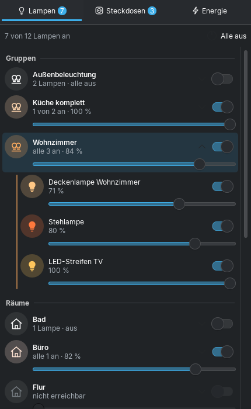
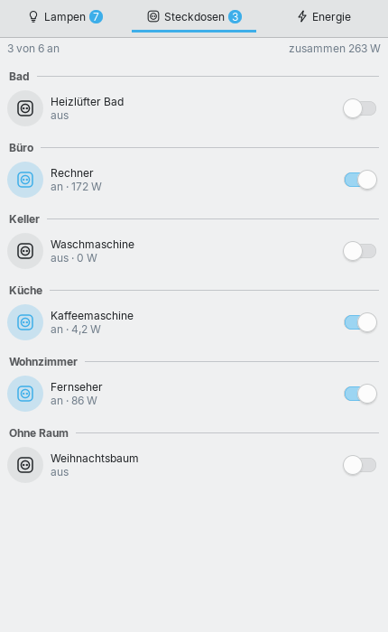
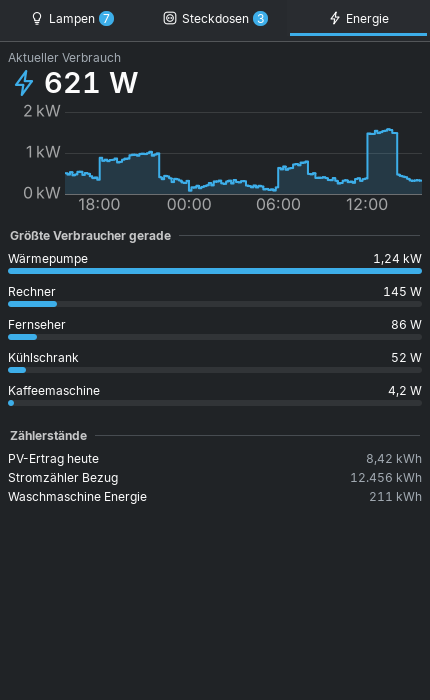

# Home Assistant für KDE Plasma 6

Ein Plasma-Widget fürs Panel, das deine **Home-Assistant-Lampen, Steckdosen und den
Energieverbrauch** im ganz normalen KDE-Look anzeigt – ein Klick aufs Symbol neben der Uhr,
und alles ist da.

| Lampen (Breeze Dunkel) | Steckdosen (Breeze Hell) | Energie |
|---|---|---|
|  |  |  |

## Was es kann

- **Lampen**: oben deine Lampengruppen, darunter die Räume (Bereiche aus Home Assistant),
  zuletzt Lampen ohne Raum. Ein Klick auf eine Gruppe oder einen Raum klappt die einzelnen
  Lampen auf. Jede Lampe und jede Gruppe hat einen Schalter und einen Helligkeitsregler; das
  Symbol leuchtet in der echten Farbe der Lampe (Farbe bzw. Weißton). „Alle aus“ mit einem Klick.
- **Steckdosen**: alle Schalter nach Raum sortiert, mit aktuellem Verbrauch, wenn die Steckdose
  misst (z. B. Shelly Plug, Tasmota, Fritz!DECT).
- **Energie**: aktueller Verbrauch, Verlauf der letzten 24 Stunden (mit Werten beim Überfahren
  mit der Maus), die größten Verbraucher als Balken und alle Zählerstände.
- **Live**: Änderungen (Schalter an der Wand, Automationen, App) erscheinen sofort über die
  WebSocket-Schnittstelle von Home Assistant.
- **Panel-Symbol** im Breeze-Stil (Haus mit Glühbirne), passt sich hellem und dunklem
  Farbschema an; ein kleines Abzeichen zeigt, wie viele Lampen an sind. Tooltip mit
  Zusammenfassung, Rechtsklick: „Alle Lampen aus“, „Home Assistant öffnen“.
- Läuft auch im **Systemabschnitt** (Systemabschnitt-Einstellungen → Einträge).

## Installation (Manjaro / Arch / jede Plasma-6-Distribution)

1. Für die Live-Aktualisierung (empfohlen):
   ```bash
   sudo pacman -S qt6-websockets
   ```
   (Ohne das Paket funktioniert das Widget auch – es fragt dann regelmäßig ab.)
2. Die Datei `home-assistant.plasmoid` aus den
   [Releases](https://github.com/Teyro/plasma-homeassistant/releases) laden und installieren:
   ```bash
   kpackagetool6 -t Plasma/Applet -i home-assistant.plasmoid
   ```
   Update auf eine neue Version: gleicher Befehl mit `-u` statt `-i`.
   Alternativ aus dem Quellcode: `kpackagetool6 -t Plasma/Applet -i package`
3. Rechtsklick aufs Panel → **Widgets hinzufügen** → „Home Assistant“ suchen und neben die Uhr
   ziehen (oder im Systemabschnitt unter „Einträge“ auf „Immer anzeigen“ stellen).
4. Rechtsklick aufs Symbol → **Home Assistant einrichten …**
   - **Adresse**, z. B. `http://homeassistant.local:8123` oder `https://ha.example.de`
   - **Langlebiger Zugriffstoken**: in Home Assistant unten links auf deinen Namen →
     *Sicherheit* → *Langlebige Zugriffstoken* → *Token erstellen*
   - „Verbindung testen“, dann optional den **Hauptzähler** (Leistungssensor deines
     Stromzählers) für den 24-Stunden-Verlauf wählen.

## Einstellungen

- Gruppen und/oder Räume anzeigen, klassische `group.*`-Gruppen einbeziehen
- Nur Schalter vom Typ „Steckdose“ zeigen
- Entitäten ausblenden, auch mit `*`: `light.flur_nachtlicht, switch.*_kindersicherung`
- Zahl der eingeschalteten Lampen am Panel-Symbol an/aus

## Gut zu wissen

- **Lampengruppen** sind Lichtgruppen aus Home Assistant (*Einstellungen → Geräte & Dienste →
  Helfer → Gruppe → Licht-Gruppe*) und klassische Gruppen, die nur Lampen enthalten.
- **Räume** kommen aus den Bereichen in Home Assistant. Dafür nutzt das Widget die
  Template-Schnittstelle (`/api/template`).
- Welcher Verbrauch zu welcher Steckdose gehört, erkennt das Widget über das Gerät
  (Steckdose und Leistungssensor am selben Gerät) – sonst am Namen.
- Lehnt Home Assistant den Token ab, hört das Widget auf zu fragen, damit deine IP nicht
  gesperrt wird (`ip_ban`). Nach einer Änderung in den Einstellungen geht es weiter.
- Der Token steht – wie alle Widget-Einstellungen – in
  `~/.config/plasma-org.kde.plasma.desktop-appletsrc`. Ein eigener Benutzer mit
  eingeschränkten Rechten in Home Assistant ist eine gute Idee.
- Selbst signierte HTTPS-Zertifikate funktionieren nicht; dann `http://` im Heimnetz oder ein
  gültiges Zertifikat (z. B. Let's Encrypt) verwenden.

## Entwicklung

Der Ordner `test/` enthält einen nachgebauten Home-Assistant-Server (REST + WebSocket) mit
Beispielwohnung und einen Test der Logik:

```bash
node test/ha-mock.mjs 8123 &      # Token: test-token
node test/logik-test.mjs
```

Mit `plasmoidviewer -a package` (aus `plasma-sdk`) lässt sich das Widget ohne Installation
ausprobieren.

## Lizenz

GPL-3.0-or-later
