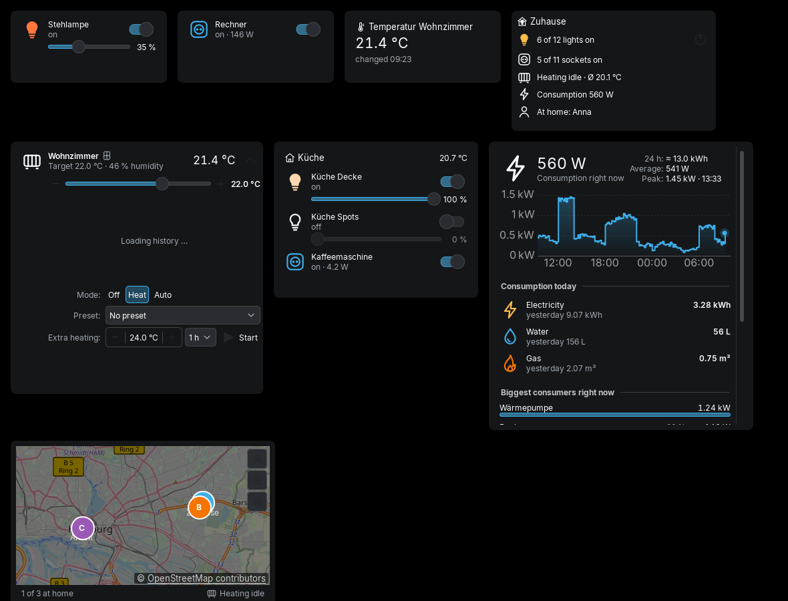

# Home Assistant ToolBox

**منزلك الذكي بنقرة واحدة – في لوحة KDE Plasma وفي شريط قوائم macOS وعلى iPhone.**

[English](../README.md) · [Deutsch](../README.de.md) · [中文](README.zh.md) · [हिन्दी](README.hi.md) · [Español](README.es.md) · **العربية** · [Français](README.fr.md) · [বাংলা](README.bn.md)

الأضواء والمقابس والتدفئة والطاقة والأشخاص من [Home Assistant](https://www.home-assistant.io/) على شكل
**أداة أصلية لـ KDE Plasma 6** و**تطبيق لشريط قوائم macOS** (بتصميم Liquid Glass على macOS 26) و
**أدوات لـ iPhone/iPad** عبر [Scriptable](https://scriptable.app). تتشارك الثلاثة المنطق نفسه والميزات نفسها.

## الميزات

- **الأضواء**: المجموعات والغرف (مناطق Home Assistant)، مفتاح وسطوع لكل ضوء، «إطفاء الكل»
- **المقابس**: مشترك الكهرباء ومجموعات المفاتيح في صف واحد بمفتاح مشترك واستهلاك إجمالي
- **الطاقة**: الاستهلاك الحالي، سجل 24 ساعة، **استهلاك اليوم** من الكهرباء والماء والغاز، أكبر المستهلكين
- **التدفئة**: درجة الحرارة والرطوبة لكل غرفة، درجة الحرارة المستهدفة، الوضع، الإعداد المسبق، **تدفئة إضافية**،
  النافذة مفتوحة/مغلقة و**مخطط 24 ساعة**
- **الأشخاص**: خريطة بالمناطق، من أين ومدى البعد عن المنزل
- **عدة نسخ من Home Assistant**، **أدوات سطح المكتب**، **تحديثات مباشرة** (WebSocket)
- **8 لغات** حسب لغة النظام، مع دعم كامل للكتابة من اليمين إلى اليسار

## التنزيل والتثبيت

جميع الملفات في صفحة [الإصدارات](https://github.com/Teyro/HomeAssistantToolBox/releases/latest):

- **KDE Plasma 6**: الملف `homeassistant-toolbox.plasmoid` ثم الأمر `kpackagetool6 -t Plasma/Applet -i homeassistant-toolbox.plasmoid`،
  ثم انقر بزر الفأرة الأيمن على اللوحة ← إضافة أدوات ← «Home Assistant ToolBox» ([الدليل](../plasma/README.md))
- **macOS 14+**: فك ضغط `HomeAssistantToolBox-macOS-x.y.z.zip` واسحبه إلى التطبيقات ثم شغّل مرة واحدة
  `xattr -dr com.apple.quarantine "/Applications/Home Assistant ToolBox.app"` ([الدليل](../macos/README.md))
- **iPhone/iPad**: احفظ `HomeAssistantToolBox.js` في مجلد Scriptable ([الدليل](../ios/README.md))

تحتاج إلى عنوان Home Assistant و**رمز وصول طويل الأمد**
(Home Assistant ← ملفك الشخصي ← *الأمان* ← *رموز الوصول طويلة الأمد* ← *إنشاء رمز*).

## الخصوصية

تتواصل التطبيقات **مع Home Assistant الخاص بك فقط** – بلا سحابة وبلا تتبع. إضافة إلى ذلك: GitHub (التحقق من التحديثات)
وخرائط OpenStreetMap. على macOS وiOS يُحفظ الرمز في سلسلة المفاتيح.

## الترجمات

أُنجزت الترجمات بمساعدة آلية. نرحب بالتصحيحات في `i18n/ar.json`!

## الترخيص والعلامة التجارية

GPL-3.0-or-later. ‏Home Assistant ToolBox مشروع مستقل **غير تابع** لـ Home Assistant أو Nabu Casa أو Open Home Foundation.
«Home Assistant» علامة تجارية لمالكها.

