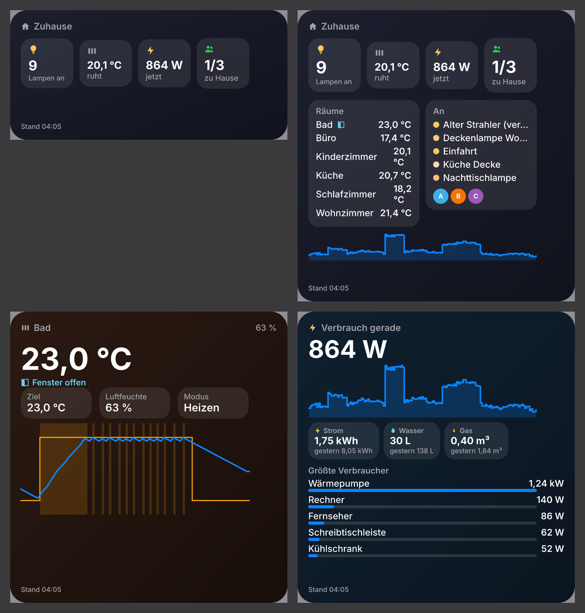
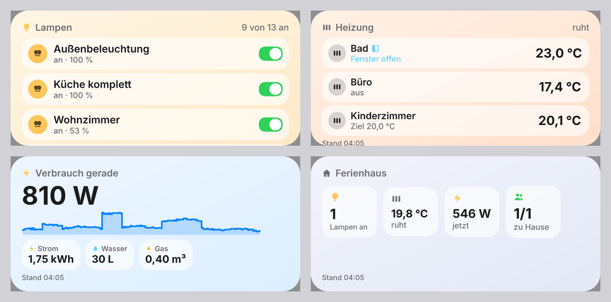
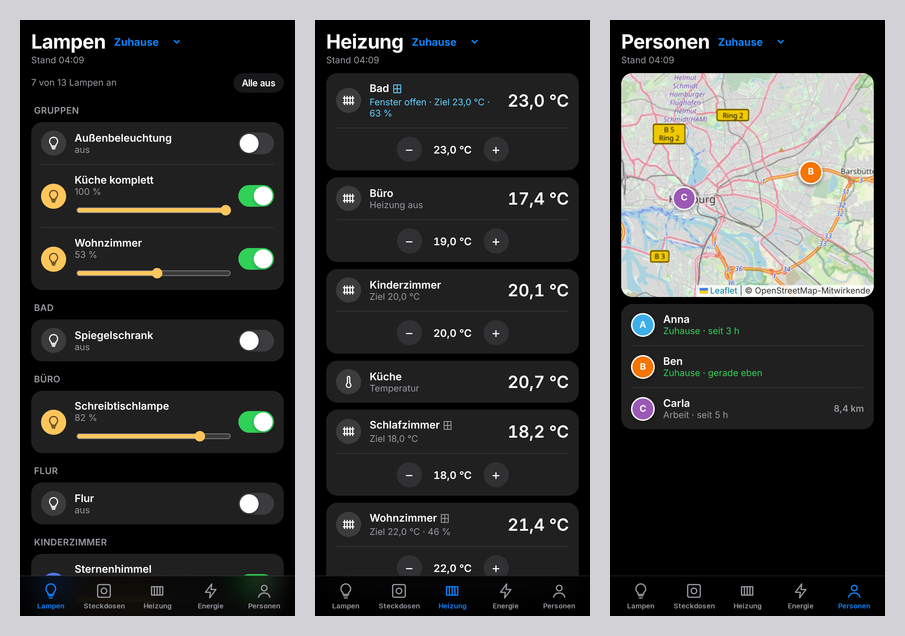
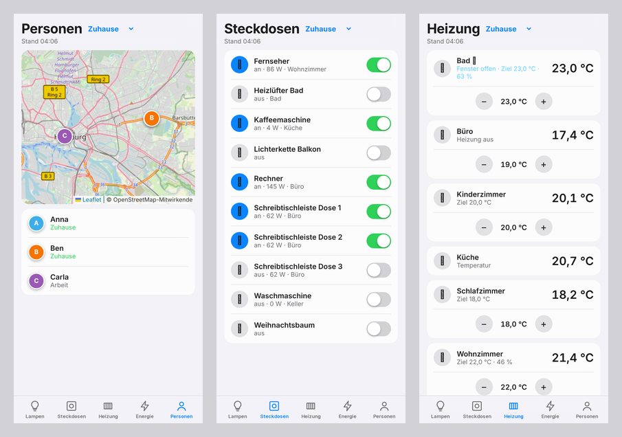

# HA Leiste für iPhone und iPad (Scriptable)

Home Assistant als Widgets auf dem Homebildschirm und Sperrbildschirm, dazu ein Dashboard zum
Schalten – mit der kostenlosen App [Scriptable](https://apps.apple.com/app/scriptable/id1405459188).
Gleicher Funktionsumfang wie das KDE-Widget und die Mac-App, die Logik ist dieselbe.

| Widgets (dunkel) | Widgets (hell) |
|---|---|
|  |  |

| Dashboard in der App | Personen, Steckdosen, Heizung |
|---|---|
|  |  |

## Akkuschonend

- Eine einzige Abfrage je Widget-Aktualisierung (`/api/states`); Räume nur 1× am Tag,
  Verläufe höchstens alle 30 Minuten – alles andere kommt aus dem Zwischenspeicher.
- Keine Dauerverbindung, keine Hintergrundarbeit. Wann Widgets neu geladen werden, entscheidet
  iOS (meist alle 15–30 Minuten).
- Ohne Netz bleibt der letzte Stand stehen (mit Uhrzeit und Hinweis).
- Nur das offene Dashboard aktualisiert sich alle 10 Sekunden – und hört beim Schließen auf.

## Installation

1. **Scriptable** aus dem App Store laden.
2. `HA-Leiste.js` aus den [Releases](https://github.com/Teyro/homeassistant-leiste/releases) in Safari
   öffnen → Teilen → **In Dateien sichern** → *iCloud Drive → Scriptable*.
   (Oder: in Scriptable ein neues Skript anlegen, den Inhalt der Datei einfügen und „HA Leiste“ nennen.)
3. Das Skript in Scriptable einmal starten → **Home Assistant hinzufügen**: Adresse und
   langlebigen Zugriffstoken eintragen (In Home Assistant: unten links dein Name → Sicherheit →
   Langlebige Zugriffstoken → Token erstellen). Den Namen übernimmt das Skript aus Home Assistant.

## Widgets

Homebildschirm lange drücken → **+** → **Scriptable** → Größe wählen → Widget hinzufügen.
Dann das Widget lange drücken → **Widget bearbeiten** → *Script*: **HA Leiste**, bei *Parameter*:

| Parameter | zeigt |
|---|---|
| *(leer)* | Übersicht: Lampen, Heizung, Verbrauch, wer zu Hause ist |
| `lampen` | Lampen und Gruppen – **Tippen schaltet** |
| `heizung` | alle Räume mit Temperatur, Fenster offen/zu, heizt? |
| `heizung:Wohnzimmer` | ein Raum groß, mit 24-Stunden-Verlauf (mittel/groß) |
| `energie` | Verbrauch gerade, Verlauf, Strom/Wasser/Gas heute, größte Verbraucher |
| `personen` | wer ist wo, wie weit weg |
| `raum:Küche` | Temperatur, Lampen und Steckdosen eines Raums |
| `lampe:Stehlampe` oder `lampe:light.flur` | eine Entität groß (Tippen schaltet) |
| `…@Ferienhaus` | eine andere Instanz als den Favoriten, z. B. `energie@Ferienhaus` |

Alle Größen werden unterstützt (klein, mittel, groß) und auf dem **Sperrbildschirm** rechteckig,
rund und als Zeile. Ein Tipp auf ein Widget öffnet das Dashboard.

**Schalten:** Widgets in iOS können selbst keine Schalter haben. Ein Tipp auf eine Lampe öffnet
kurz Scriptable, schaltet und zeigt das Dashboard. Dort geht alles direkt: Schalter, Helligkeit,
Zieltemperatur mit −/+, „Alle aus“, Instanz wechseln.

## Einstellungen (Skript in Scriptable starten → Einstellungen)

- Mehrere Home-Assistant-Instanzen, eine als **Favorit (★)**
- Hauptzähler (Leistung des Stromzählers) und Zähler für Strom/Wasser/Gas – ohne Auswahl sucht
  das Skript passende Zähler selbst
- Entitäten ausblenden (mit `*`)
- **Nach Updates suchen**: zeigt die Änderungen und ersetzt das Skript auf Wunsch durch die neue
  Version (nur Downloads aus diesem Projekt). In der App wird höchstens einmal am Tag nachgesehen.

Die Token liegen im Schlüsselbund von iOS.

## Entwicklung

`ios/quelle/HA-Leiste.js` ist die Vorlage, `node ios/baue.mjs` setzt die gemeinsame Logik aus dem
Plasma-Widget (`logik.js`) ein und schreibt `ios/HA-Leiste.js`.
