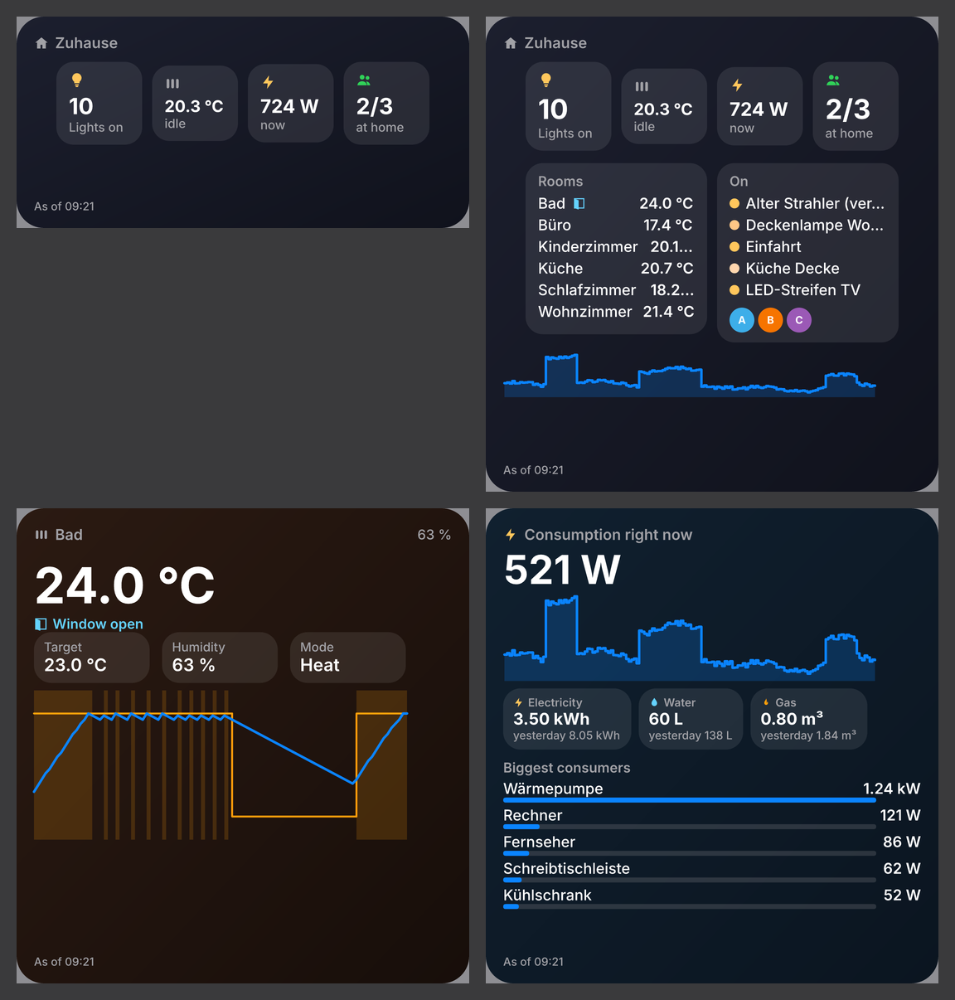
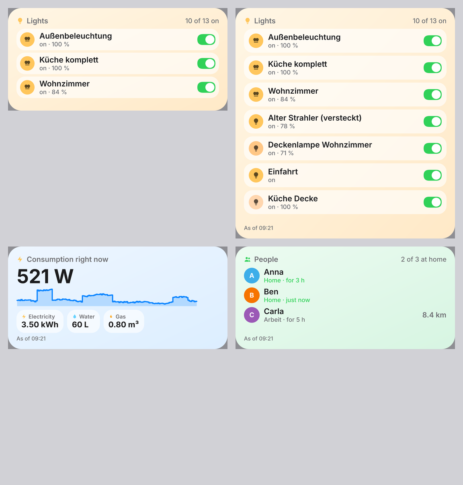
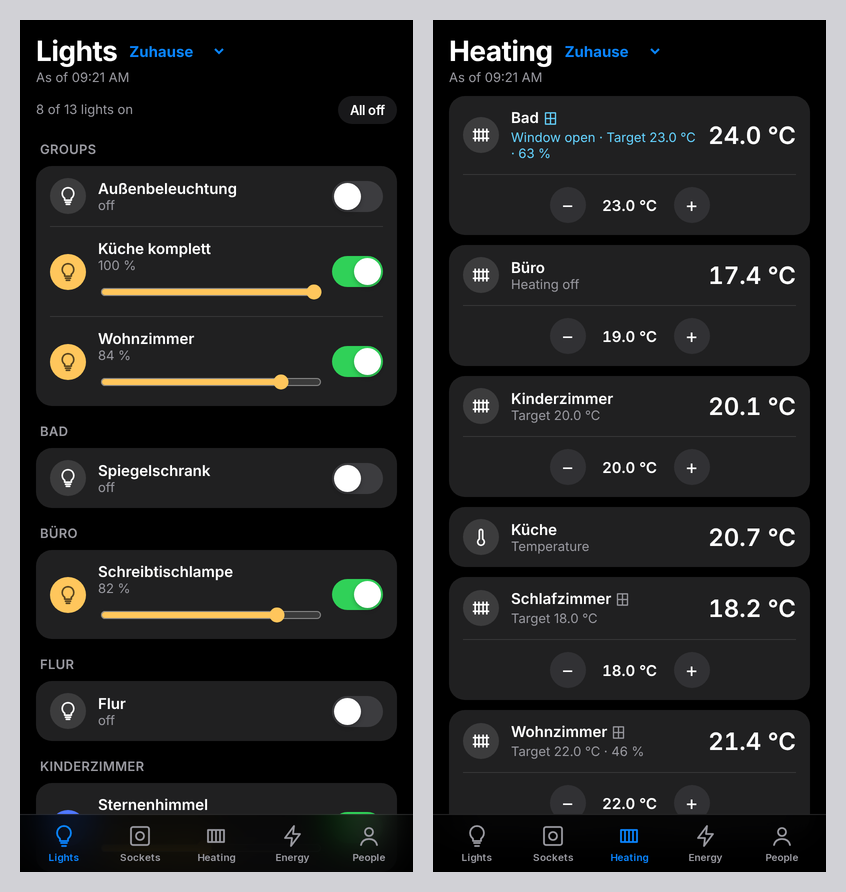
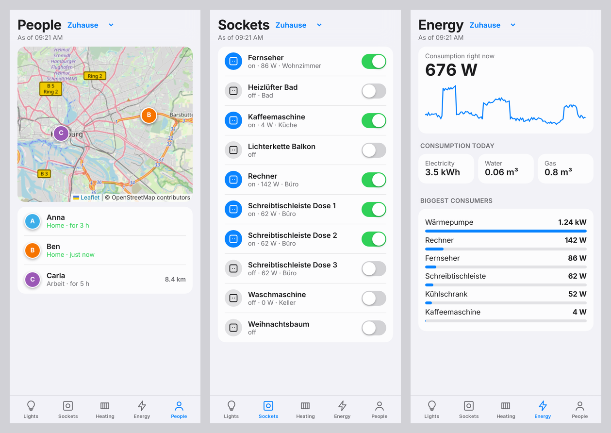

# Home Assistant ToolBox for iPhone and iPad (Scriptable)

**English** · [Deutsch](README.de.md)

Home Assistant as widgets on your home screen and lock screen, plus a dashboard for switching – with the free app
[Scriptable](https://apps.apple.com/app/scriptable/id1405459188). Same features as the KDE widget and the Mac app;
the logic is shared.

| Widgets (dark) | Widgets (light) |
|---|---|
|  |  |

| Dashboard | People, sockets, heating |
|---|---|
|  |  |

## Battery friendly

- One request per widget refresh (`/api/states`); rooms once a day, history at most every 30 minutes – everything
  else comes from the cache.
- No permanent connection, no background work. iOS decides when widgets refresh (usually every 15–30 minutes).
- Offline the last state stays visible (with time and a hint).
- Only the open dashboard refreshes every 10 seconds – and stops when closed.

## Installation

1. Install **Scriptable** from the App Store.
2. Open `HomeAssistantToolBox.js` from the [Releases](https://github.com/Teyro/HomeAssistantToolBox/releases/latest)
   in Safari → Share → **Save to Files** → *iCloud Drive → Scriptable*.
   (Or create a new script in Scriptable, paste the file content and name it “Home Assistant ToolBox”.)
3. Run the script in Scriptable once → **Add Home Assistant**: enter address and long‑lived access token
   (in Home Assistant: your name bottom left → Security → Long‑lived access tokens → Create token).

## Widgets

Long‑press the home screen → **+** → **Scriptable** → choose a size → add widget.
Then long‑press the widget → **Edit Widget** → *Script*: **Home Assistant ToolBox**, *Parameter*:

| Parameter | shows |
|---|---|
| *(empty)* | overview: lights, heating, consumption, who is home |
| `lights` | lights and groups – **tap to switch** |
| `heating` | all rooms with temperature, window open/closed, heating? |
| `heating:Living room` | one room large, with 24‑hour chart (medium/large) |
| `energy` | current consumption, chart, electricity/water/gas today, biggest consumers |
| `people` | who is where, how far away |
| `room:Kitchen` | temperature, lights and sockets of a room |
| `light:Floor lamp` or `light:light.hall` | one entity large (tap to switch) |
| `…@Holiday house` | another instance than the favourite, e.g. `energy@Holiday house` |

(The German keywords `lampen`, `heizung`, `energie`, `personen`, `raum`, `lampe` work as well.)

All sizes are supported (small, medium, large) and on the **lock screen** rectangular, circular and inline.
Tapping a widget opens the dashboard.

**Switching:** iOS widgets cannot have real switches. Tapping a light briefly opens Scriptable, switches and shows
the dashboard. In the dashboard everything works directly: switches, brightness, target temperature with −/+,
“All off”, switching instances. Switch links contain a secret key, so other apps or websites cannot switch your
lights through Scriptable.

## Settings (run the script in Scriptable → Settings)

- Several Home Assistant instances, one as **favourite (★)**
- Main meter and meters for electricity/water/gas – without a choice the script finds suitable meters itself
- Hide entities (wildcards with `*`)
- **Check for updates**: shows the changes and replaces the script with the new version on request (only
  downloads from this project). The app checks at most once a day.

Tokens are stored in the iOS Keychain.

## Development

`ios/quelle/HomeAssistantToolBox.js` is the template; `node ios/baue.mjs` inserts the shared logic from the Plasma
widget (`logik.js`) and the translations and writes `ios/HomeAssistantToolBox.js`.

## License

GPL-3.0-or-later
