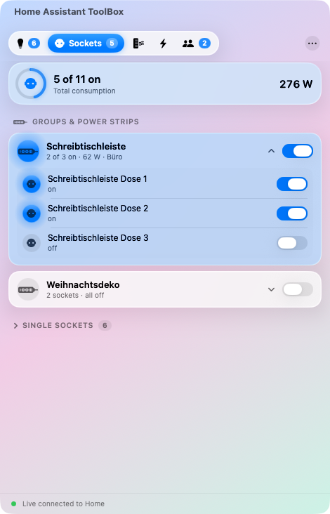
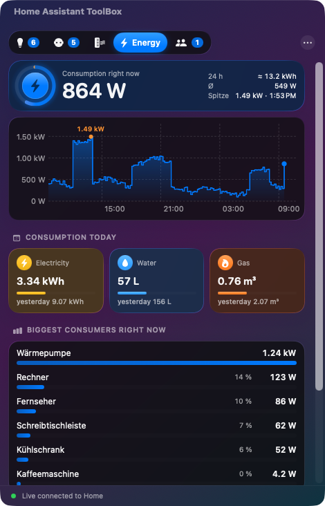
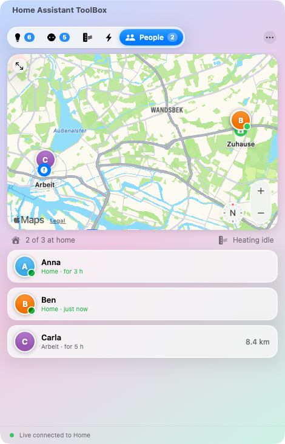
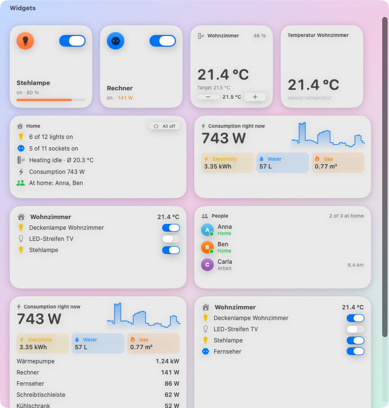
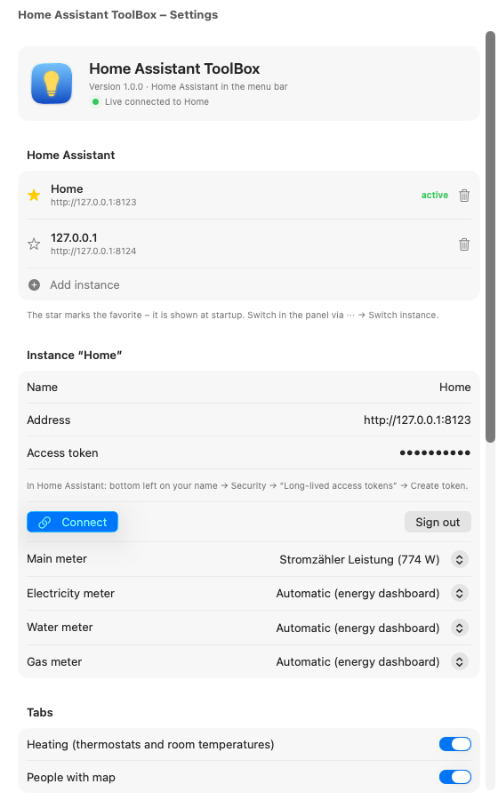

# Home Assistant ToolBox for the macOS menu bar

**English** · [Deutsch](README.de.md)

Lights, sockets, heating, energy and people from [Home Assistant](https://www.home-assistant.io/) one click away in
the menu bar – in the **Liquid Glass design of macOS 26 Tahoe**, with desktop widgets. Same features as the
[KDE Plasma widget](../plasma/README.md).

| Lights (dark) | Sockets (light) | Energy (dark) |
|---|---|---|
|  |  |  |

| Heating | People |
|---|---|
|  |  |

## Features

- **Lights**: light groups and rooms from Home Assistant that expand, lights without a room. Switch and
  brightness slider for every light, group and room; the icon glows in the real light colour. “All off”.
- **Sockets**: switch groups and power strips as one row with shared switch and total consumption; single
  sockets by room. Device settings (LED, child lock …) are filtered out.
- **Energy**: current consumption with 24‑hour figures, chart with values on hover, **today’s usage** of
  electricity, water and gas (compared with yesterday), biggest consumers and all meters.
- **Heating**: every room with live temperature and humidity, target temperature with slider and −/+, mode,
  preset and **boost** for 30 minutes to 4 hours – then back automatically.
- **Windows and history**: window open/closed icon on every radiator; click it for the last 24 hours
  (actual, target, heating phases).
- **People**: Apple Maps with zones and all people, who is where, since when and how far away.
- **Several instances** with a favourite (★); switch via ⋯ → “Switch instance”.
- **Desktop widgets**: overview, light, socket, heating, room, energy, people and any entity – switch lights and
  sockets right in the widget, change the temperature with −/+.
- **Live** via the Home Assistant WebSocket API; reconnects after sleep.
- **Updates**: new versions are announced in the panel, “What’s new?” shows the changes, “Install and restart”
  downloads the update from GitHub, verifies it and replaces the app.
- Token stored in the **macOS Keychain**.
- 8 languages, following the system language. Runs on macOS 14+; Liquid Glass on macOS 26.

## Installation

1. Download `HomeAssistantToolBox-macOS-x.y.z.zip` from the
   [Releases](https://github.com/Teyro/HomeAssistantToolBox/releases/latest), unzip it and drag
   **Home Assistant ToolBox** into *Applications*.
2. The app is not notarised by Apple (that requires a paid developer account), so macOS refuses to open it the
   first time. Run once in Terminal:
   ```bash
   xattr -dr com.apple.quarantine "/Applications/Home Assistant ToolBox.app"
   ```
   or: *System Settings → Privacy & Security* → at the bottom **“Open Anyway”**.
3. Start the app – a light bulb appears in the menu bar. Click it → **Set up …**
4. Enter the address (e.g. `http://homeassistant.local:8123`) and a token: in Home Assistant click your name
   (bottom left) → **Security** → **Long‑lived access tokens** → **Create token**. Click **Connect**.
   macOS may ask whether the app may access devices on your local network → **Allow**.

Upgrading from *Home Assistant Leiste*: your instances are taken over; macOS may ask once whether the app may read
the token from the keychain → **Always Allow**. Then delete the old app.

### Desktop widgets

Right‑click the desktop → **Edit Widgets …** → search **Home Assistant ToolBox** → drag a widget to the desktop.
For light, socket, heating, room and entity: right‑click the widget → **Edit Widget** → choose what it shows.
Widgets get their data from the running app (enable “Start at login”).



## Settings



- Show groups and/or rooms, include classic `group.*` groups
- Only show switches of type “outlet”
- Main meter (power sensor of the electricity meter) for chart and shares
- Today’s usage: electricity, water and gas individually; meters come from the Home Assistant energy dashboard
  or can be chosen by hand
- Hide entities, wildcards allowed: `light.hall_nightlight, switch.*_child_lock`
- Badge in the menu bar, start at login, polling interval without live connection

## Good to know

- If the token is rejected the app stops asking – Home Assistant would otherwise ban your IP (`ip_ban`).
  Address and token are only saved after a successful test.
- Quit: click the icon → **⋯** → **Quit Home Assistant ToolBox**.

## Development

```bash
cd macos
swift test                 # logic tests
./scripts/baue-app.sh      # build/Home Assistant ToolBox.app with widgets + ZIP (needs Xcode + XcodeGen)
node ../test/ha-mock.mjs & # mock Home Assistant on port 8123 (token: test-token)
HA_TOKEN=test-token HA_HAUPTZAEHLER=sensor.stromzaehler_leistung \
  "build/Home Assistant ToolBox.app/Contents/MacOS/HAToolBox" --vorschau Dark   # screenshots
```

## License

GPL-3.0-or-later
