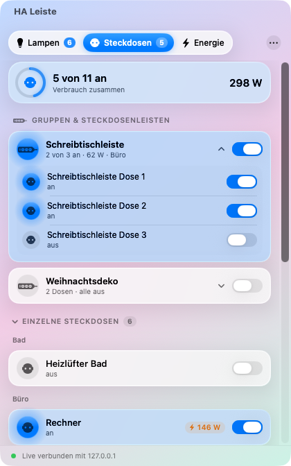
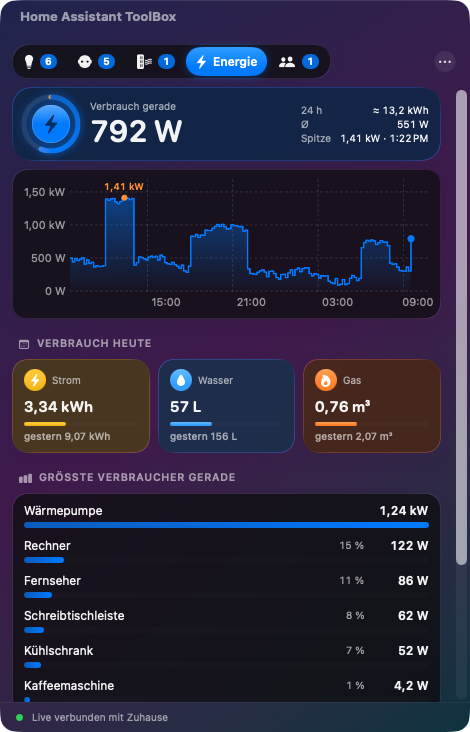
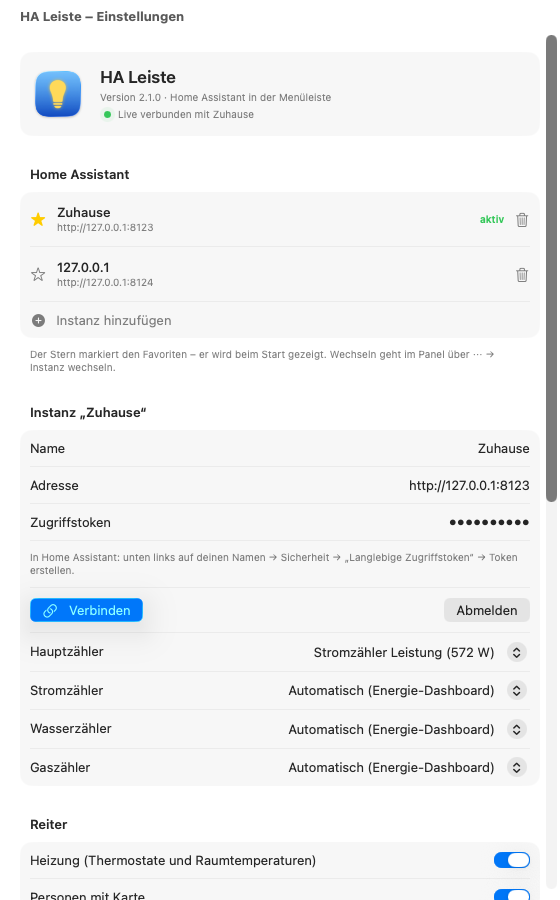

# HA Leiste – Home Assistant in der macOS-Menüleiste

Lampen, Steckdosen und Energieverbrauch aus [Home Assistant](https://www.home-assistant.io/) mit einem Klick
in der Menüleiste – im **Liquid-Glass-Design von macOS 26 Tahoe**. Gegenstück zum
[Plasma-Widget für KDE](../plasma/README.md) mit dem gleichen Funktionsumfang.

| Lampen (Dunkel) | Steckdosen (Hell) | Energie (Dunkel) |
|---|---|---|
|  |  |  |

| Heizung | Personen |
|---|---|
|  |  |

## Was es kann

- **Lampen**: Lampengruppen und Räume aus Home Assistant zum Aufklappen, Lampen ohne Raum.
  Schalter und Helligkeitsregler für jede Lampe, jede Gruppe und jeden Raum. Das Symbol
  leuchtet in der echten Lampenfarbe bzw. im Weißton der Farbtemperatur. „Alle aus“ mit einem Klick.
- **Steckdosen**: Schaltergruppen und Geräte mit mehreren Dosen (Steckdosenleisten) als eine Zeile
  mit gemeinsamem Schalter und Gesamtverbrauch, zum Aufklappen. Einzelne Steckdosen darunter,
  nach Raum sortiert und zunächst eingeklappt. Geräte-Einstellungen (LED, Kindersicherung …)
  werden herausgefiltert.
- **Energie**: aktueller Verbrauch mit Kennzahlen der letzten 24 Stunden (Energie, Durchschnitt,
  Spitze), Verlauf mit Werten beim Überfahren mit der Maus, **Verbrauch heute** an Strom, Wasser
  und Gas (mit dem Wert von gestern), die größten Verbraucher mit Anteil und alle Zählerstände.
- **Heizung**: alle Räume mit Temperatur (live) und Luftfeuchte, Zieltemperatur mit Regler
  (blau → orange) und −/+, Modus, Profil und **Extra heizen** für 30 Minuten bis 4 Stunden –
  danach geht die Temperatur von selbst zurück.
- **Personen**: Apple-Karte mit Zonen (Zuhause, Arbeit …) und allen Personen, darunter wer wo
  ist, seit wann und wie weit weg – und ob gerade geheizt wird.
- **Mehrere Instanzen**: beliebig viele Home-Assistant-Installationen, eine als Favorit (★, wird
  beim Start gezeigt). Wechseln im Panel über ⋯ → „Instanz wechseln“.
- **Widgets für den Schreibtisch**: Übersicht, Lampe, Steckdose, Heizung, Raum, Energie,
  Personen und eine beliebige Entität – Lampen und Steckdosen lassen sich direkt im Widget
  schalten, die Heizung mit −/+ verstellen.
- **Live**: Änderungen (Schalter an der Wand, Automationen, App) erscheinen sofort über die
  WebSocket-Schnittstelle von Home Assistant. Nach dem Ruhezustand verbindet sich die App neu.
- **Menüleiste**: Glühbirne mit der Zahl der eingeschalteten Lampen.
- Der Zugriffstoken liegt im **Schlüsselbund** von macOS.
- Läuft ab macOS 14; Liquid Glass ab macOS 26, davor mit dem bisherigen Material-Look.

## Installation

1. `HA-Leiste-x.y.z.zip` aus den [Releases](https://github.com/Teyro/homeassistant-leiste/releases) laden,
   entpacken und **HA Leiste** in den Ordner *Programme* ziehen.
2. Die App ist nicht bei Apple beglaubigt (dafür bräuchte es ein kostenpflichtiges Entwicklerkonto).
   Beim ersten Start meldet macOS deshalb, dass sie nicht geöffnet werden kann. Dann einmal im Terminal:
   ```bash
   xattr -dr com.apple.quarantine "/Applications/HA Leiste.app"
   ```
   oder: *Systemeinstellungen → Datenschutz & Sicherheit* → ganz unten **„Dennoch öffnen“**.
3. App starten – oben rechts in der Menüleiste erscheint eine Glühbirne. Klick darauf → **Einrichten …**
4. Adresse eintragen (z. B. `http://homeassistant.local:8123`) und einen Token: In Home Assistant
   unten links auf deinen Namen → **Sicherheit** → **Langlebige Zugriffstoken** → **Token erstellen**.
   Auf **Verbinden** klicken. macOS fragt evtl., ob die App auf Geräte im lokalen Netzwerk zugreifen darf → **Erlauben**.

Nach einem Update fragt macOS evtl. einmal, ob HA Leiste den Token im Schlüsselbund lesen darf → **Immer erlauben**.

### Widgets auf den Schreibtisch legen

Rechtsklick auf den Schreibtisch → **Widgets bearbeiten …** → links **HA Leiste** suchen → Widget
auf den Schreibtisch ziehen. Bei Lampe, Steckdose, Heizung, Raum und Entität: Rechtsklick auf das
Widget → **Widget bearbeiten** → auswählen, was es zeigen soll. Die Widgets bekommen ihre Daten
von der laufenden App (HA Leiste muss also laufen – am besten „Beim Anmelden starten“ einschalten).


## Einstellungen



- Gruppen und/oder Räume anzeigen, klassische `group.*`-Gruppen einbeziehen
- Nur Schalter vom Typ „Steckdose“ zeigen
- Hauptzähler (Leistungssensor des Stromzählers) für Verlauf und Anteile
- Verbrauch heute: Strom, Wasser und Gas einzeln ein- und ausblenden. Die Zähler kommen
  automatisch aus dem Energie-Dashboard von Home Assistant (gleiche Werte wie dort) oder lassen
  sich von Hand wählen.
- Entitäten ausblenden, auch mit `*`: `light.flur_nachtlicht, switch.*_kindersicherung`
- Zahl am Menüleisten-Symbol, beim Anmelden starten, Abfrage-Intervall ohne Live-Verbindung

## Gut zu wissen

- Wird der Token abgelehnt, fragt die App nicht weiter nach – Home Assistant sperrt sonst nach einigen
  Fehlversuchen die IP-Adresse (`ip_ban`). Adresse und Token werden erst nach erfolgreichem Test übernommen.
- Beenden: Klick auf das Symbol → **⋯** → **HA Leiste beenden**.

## Entwicklung

```bash
cd macos
swift test                 # Logik prüfen
./scripts/baue-app.sh      # build/HA Leiste.app mit Widgets und ZIP (Xcode + XcodeGen nötig)
node ../test/ha-mock.mjs & # nachgebautes Home Assistant auf Port 8123 (Token: test-token)
HA_TOKEN=test-token HA_HAUPTZAEHLER=sensor.stromzaehler_leistung \
  "build/HA Leiste.app/Contents/MacOS/HALeiste" --vorschau Dark   # Bildschirmfotos
```

Der GitHub-Workflow baut auf macOS 26, testet, macht die Bildschirmfotos und hängt bei einem
Tag `v*` das ZIP (zusammen mit dem KDE-Widget) an das Release.

## Lizenz

GPL-3.0-or-later
