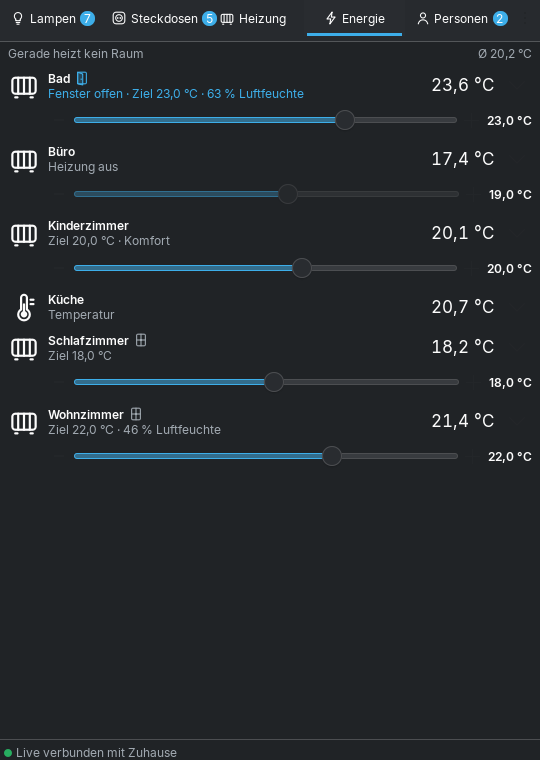

# Home Assistant für KDE Plasma 6

[English](README.md) · **Deutsch**

Ein Plasma-Widget fürs Panel, das deine **Home-Assistant-Lampen, Steckdosen und den
Energieverbrauch** im ganz normalen KDE-Look anzeigt – ein Klick aufs Symbol neben der Uhr,
und alles ist da.

| Lampen (Breeze Dunkel) | Steckdosen (Breeze Hell) | Energie |
|---|---|---|
|  |  |  |

| Heizung | Personen |
|---|---|
|  |  |

**Kacheln auf dem Schreibtisch:**


## Was es kann

- **Lampen**: oben deine Lampengruppen, darunter die Räume (Bereiche aus Home Assistant),
  zuletzt Lampen ohne Raum. Ein Klick auf eine Gruppe oder einen Raum klappt die einzelnen
  Lampen auf. Jede Lampe und jede Gruppe hat einen Schalter und einen Helligkeitsregler; das
  Symbol leuchtet in der echten Farbe der Lampe (Farbe bzw. Weißton). „Alle aus“ mit einem Klick.
- **Steckdosen**: Schaltergruppen aus Home Assistant und Geräte mit mehreren Dosen
  (Steckdosenleisten) als eine Zeile mit gemeinsamem Schalter und Gesamtverbrauch – zum
  Aufklappen wie bei den Lampen. Einzelne Steckdosen darunter, nach Raum sortiert und zunächst
  eingeklappt. Verbrauch, wenn die Steckdose misst (z. B. Shelly Plug, Tasmota, Fritz!DECT).
- **Energie**: aktueller Verbrauch mit Kennzahlen der letzten 24 Stunden (Energie, Durchschnitt,
  Spitze), Verlauf mit Werten beim Überfahren mit der Maus, **Verbrauch heute** an Strom,
  Wasser und Gas (mit dem Wert von gestern), die größten Verbraucher mit Anteil und alle
  Zählerstände.
- **Heizung**: alle Räume mit Temperatur (live) und Luftfeuchte. Zieltemperatur mit Regler
  und −/+, Modus (Aus/Heizen/Automatik), Profil (Eco, Komfort …) und **Extra heizen**: eine
  Temperatur für 30 Minuten bis 4 Stunden, danach automatisch zurück – auch nach einem Neustart.
- **Fenster und Verlauf**: bei jeder Heizung ein Symbol für Fenster offen/zu (Fensterkontakte im
  Raum oder das Thermostat selbst); ein Klick auf die Heizung zeigt den Verlauf der letzten
  24 Stunden – Ist- und Zieltemperatur und wann geheizt wurde.
- **Updates**: das Widget meldet neue Versionen (GitHub). Menü ⋮ → „Was ist neu?“ zeigt die
  Änderungen, „Installieren“ spielt das Update mit `kpackagetool6` ein, danach „Plasma neu starten“.
- **Personen**: Karte wie bei „Wo ist?“ mit Zonen (Zuhause, Arbeit …), darunter wer wo ist, seit
  wann und wie weit von zu Hause – dazu, ob gerade geheizt wird.
- **Mehrere Instanzen**: beliebig viele Home-Assistant-Installationen, eine als Favorit (wird
  beim Start gezeigt). Wechseln über das Menü ⋮ → „Instanz wechseln“.
- **Kacheln für den Schreibtisch**: das Widget einfach auf den Schreibtisch ziehen – je Kachel
  wählbar: Übersicht, eine Lampe, eine Steckdose, ein Raum, eine Heizung, Energie, Personen,
  eine beliebige Entität oder alles. Mehrere Kacheln = Widget mehrmals hinziehen; schon
  eingerichtete Instanzen werden übernommen.
- **Live**: Änderungen (Schalter an der Wand, Automationen, App) erscheinen sofort über die
  WebSocket-Schnittstelle von Home Assistant.
- **Panel-Symbol** im Breeze-Stil (Haus mit Glühbirne), so groß wie die Symbole im
  Systemabschnitt (oder wahlweise so hoch wie das Panel), passt sich hellem und dunklem
  Farbschema an; ein kleines Abzeichen zeigt, wie viele Lampen an sind. Tooltip mit
  Zusammenfassung, Rechtsklick: „Alle Lampen aus“, „Home Assistant öffnen“.
- Läuft auch im **Systemabschnitt** (Systemabschnitt-Einstellungen → Einträge).

## Installation (Manjaro / Arch / jede Plasma-6-Distribution)

1. Für die Live-Aktualisierung (empfohlen):
   ```bash
   sudo pacman -S qt6-websockets
   ```
   (Ohne das Paket funktioniert das Widget auch – es fragt dann regelmäßig ab.)
2. Die Datei `homeassistant-toolbox.plasmoid` aus den
   [Releases](https://github.com/Teyro/HomeAssistantToolBox/releases) laden und installieren:
   ```bash
   kpackagetool6 -t Plasma/Applet -i homeassistant-toolbox.plasmoid
   ```
   Update auf eine neue Version: gleicher Befehl mit `-u` statt `-i`.
   Alternativ aus dem Quellcode: `kpackagetool6 -t Plasma/Applet -i package`
3. Rechtsklick aufs Panel → **Widgets hinzufügen** → „Home Assistant“ suchen und neben die Uhr
   ziehen (oder im Systemabschnitt unter „Einträge“ auf „Immer anzeigen“ stellen).
4. Rechtsklick aufs Symbol → **Home Assistant einrichten …**
   - **Adresse**, z. B. `http://homeassistant.local:8123` oder `https://ha.example.de`
   - **Langlebiger Zugriffstoken**: in Home Assistant unten links auf deinen Namen →
     *Sicherheit* → *Langlebige Zugriffstoken* → *Token erstellen*
   - „Verbindung testen“, dann optional den **Hauptzähler** (Leistungssensor deines
     Stromzählers) für den 24-Stunden-Verlauf wählen.

## Einstellungen

- **Instanzen**: hinzufügen, entfernen, Stern = Favorit. Ohne Namen wird der Name der
  Installation aus Home Assistant übernommen. Hauptzähler und Zähler je Instanz.
- Reiter Heizung und Personen ein- und ausblenden
- **Schreibtisch**: was die Kachel zeigt (eigene Einstellungsseite)
- Gruppen und/oder Räume anzeigen, klassische `group.*`-Gruppen einbeziehen
- Nur Schalter vom Typ „Steckdose“ zeigen
- Entitäten ausblenden, auch mit `*`: `light.flur_nachtlicht, switch.*_kindersicherung`
- Zahl der eingeschalteten Lampen am Panel-Symbol an/aus, Symbolgröße
- Verbrauch heute: Strom, Wasser und Gas einzeln ein- und ausblenden. Die Zähler kommen
  automatisch aus dem Energie-Dashboard von Home Assistant (gleiche Werte wie dort) oder
  lassen sich von Hand wählen.

## Gut zu wissen

- **Karte**: Kartenkacheln von [OpenStreetMap Deutschland](https://www.openstreetmap.de/)
  (© OpenStreetMap-Mitwirkende). Es werden nur die gerade sichtbaren Kacheln geladen.
- **Extra heizen** setzt die Temperatur zurück, solange das Widget läuft (Plasma ist an). War
  der Rechner aus, passiert das beim nächsten Start.
- Die Instanzen (mit Token) werden zum Übernehmen in weitere Widgets unter
  `~/.config/homeassistanttoolbox/instanzen.json` abgelegt (nur für dich lesbar).

- **Lampengruppen** sind Lichtgruppen aus Home Assistant (*Einstellungen → Geräte & Dienste →
  Helfer → Gruppe → Licht-Gruppe*) und klassische Gruppen, die nur Lampen enthalten.
- **Räume** kommen aus den Bereichen in Home Assistant. Dafür nutzt das Widget die
  Template-Schnittstelle (`/api/template`).
- Welcher Verbrauch zu welcher Steckdose gehört, erkennt das Widget über das Gerät
  (Steckdose und Leistungssensor am selben Gerät) – sonst am Namen.
- **Steckdosen-Liste**: Geräte-Einstellungen, die Home Assistant als Schalter führt (z. B.
  „LED an der Steckdose“, „Kindersicherung“, Firmware-Updates), werden ausgeblendet – genau
  über das Entitäten-Register von Home Assistant, wenn `qt6-websockets` installiert ist,
  sonst anhand typischer Namen. Weitere lassen sich in den Einstellungen unter „Ausblenden“
  entfernen, oder „Nur Schalter vom Typ Steckdose“ wählen.
- Lehnt Home Assistant den Token ab, hört das Widget auf zu fragen, damit deine IP nicht
  gesperrt wird (`ip_ban`). Nach einer Änderung in den Einstellungen geht es weiter.
- Der Token steht – wie alle Widget-Einstellungen – in
  `~/.config/plasma-org.kde.plasma.desktop-appletsrc`. Geht ein Token verloren, lässt er
  sich in Home Assistant im Profil unter *Sicherheit* löschen.
- Selbst signierte HTTPS-Zertifikate funktionieren nicht; dann `http://` im Heimnetz oder ein
  gültiges Zertifikat (z. B. Let's Encrypt) verwenden.

## Entwicklung

Im Hauptordner liegt unter `test/` ein nachgebauter Home-Assistant-Server (REST + WebSocket)
mit Beispielwohnung (für KDE-Widget und Mac-App gemeinsam), hier ein Test der Logik:

```bash
node test/ha-mock.mjs 8123 &      # im Hauptordner; Token: test-token
node plasma/test/logik-test.mjs
```

Mit `plasmoidviewer -a plasma/package` (aus `plasma-sdk`) lässt sich das Widget ohne Installation
ausprobieren.

## Lizenz

GPL-3.0-or-later
