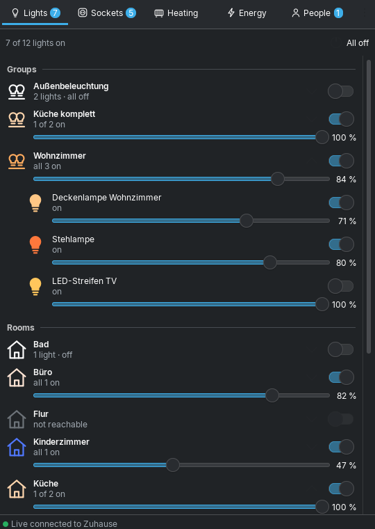
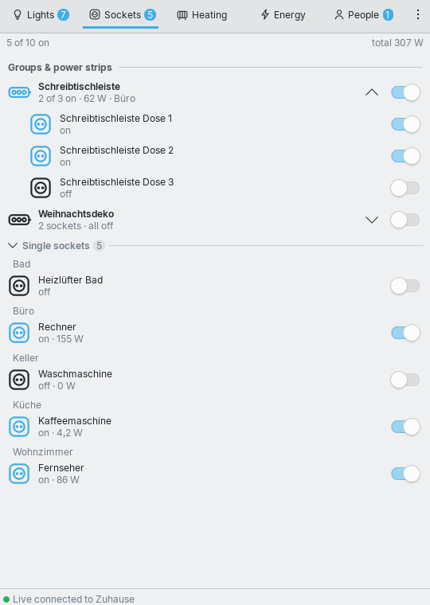
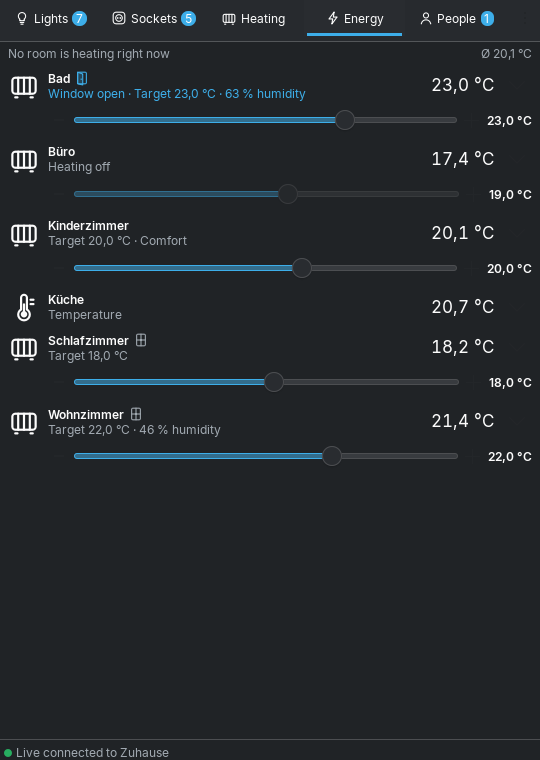
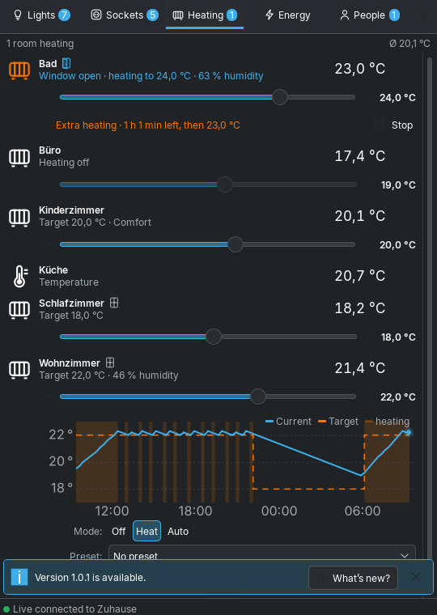
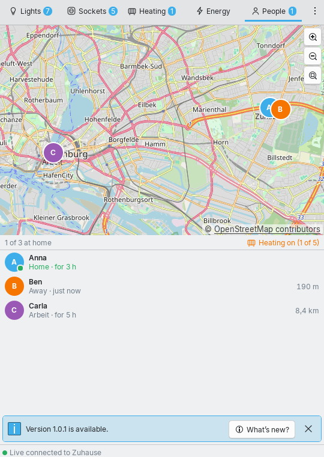
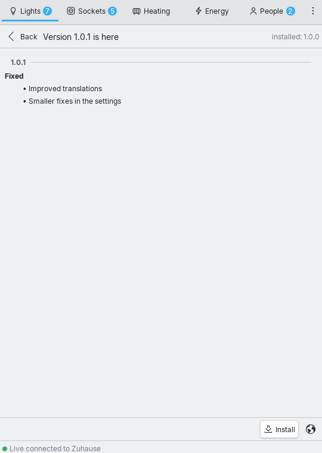

# Home Assistant ToolBox for KDE Plasma 6

**English** · [Deutsch](README.de.md)

A Plasma widget for your panel that shows your **Home Assistant lights, sockets, heating, energy and people**
in the familiar Breeze look – one click on the icon next to the clock and everything is there.

| Lights (Breeze Dark) | Sockets (Breeze Light) | Energy |
|---|---|---|
|  |  |  |

| Heating with 24 h chart | People | What’s new? |
|---|---|---|
|  |  |  |

**Tiles on the desktop:**


## Features

- **Lights**: your light groups at the top, then the rooms (Home Assistant areas), then lights without a room.
  Click a group or room to expand it. Every light, group and room has a switch and a brightness slider; the
  icon glows in the light’s real colour or white temperature. “All off” with one click.
- **Sockets**: switch groups and devices with several outlets (power strips) as one row with a shared switch
  and total consumption. Single sockets below, sorted by room. Consumption is shown when the socket measures it
  (Shelly Plug, Tasmota, Fritz!DECT …).
- **Energy**: current consumption with 24‑hour figures (energy, average, peak), chart with values on hover,
  **today’s usage** of electricity, water and gas (compared with yesterday), biggest consumers and all meters.
- **Heating**: every room with live temperature and humidity. Target temperature with slider and −/+, mode
  (off/heat/auto), preset (eco, comfort …) and **boost**: a temperature for 30 minutes to 4 hours, then back
  automatically – even after a restart.
- **Windows and history**: an icon for window open/closed on every radiator; click a radiator to see the last
  24 hours – actual and target temperature and when it was heating.
- **People**: a map like “Find My” with zones (home, work …), who is where, since when and how far from home.
- **Several instances**: any number of Home Assistant installations, one as favourite (shown on start).
  Switch via menu ⋮ → “Switch instance”.
- **Desktop tiles**: drag the widget onto the desktop and choose per tile: overview, a light, a socket, a room,
  a radiator, energy, people, any entity – or everything.
- **Live**: changes (wall switch, automations, app) appear immediately via the Home Assistant WebSocket API.
- **Updates**: the widget reports new versions; ⋮ → “What’s new?” shows the changes, “Install” updates
  with `kpackagetool6`, then “Restart Plasma”.
- **Panel icon** in Breeze style with a badge for the number of lights on; tooltip with summary; right‑click:
  “All lights off”, “Open Home Assistant”. Also works in the system tray.
- Follows your **system language** (8 languages, including right‑to‑left Arabic).

## Installation (any distribution with Plasma 6)

1. For live updates (recommended) install Qt WebSockets:
   ```bash
   sudo pacman -S qt6-websockets          # Arch, Manjaro, EndeavourOS
   sudo dnf install qt6-qtwebsockets      # Fedora
   sudo zypper install qt6-websockets     # openSUSE
   sudo apt install qml6-module-qtwebsockets   # Kubuntu, KDE neon, Debian
   ```
   (Without it the widget still works and polls regularly.)
2. Download `homeassistant-toolbox.plasmoid` from the
   [Releases](https://github.com/Teyro/HomeAssistantToolBox/releases/latest) and install it:
   ```bash
   kpackagetool6 -t Plasma/Applet -i homeassistant-toolbox.plasmoid
   ```
   To update: same command with `-u` instead of `-i` (or simply use the built‑in updater).
   From source: `kpackagetool6 -t Plasma/Applet -i plasma/package`
3. Right‑click the panel → **Add Widgets** → search for “Home Assistant ToolBox” and drag it next to the clock.
4. Right‑click the icon → **Configure Home Assistant ToolBox …**
   - **Address**, e.g. `http://homeassistant.local:8123` or `https://ha.example.com`
   - **Long‑lived access token**: in Home Assistant click your name (bottom left) → *Security* →
     *Long‑lived access tokens* → *Create token*
   - “Test connection”, then optionally choose the **main meter** (power sensor of your electricity meter)
     for the 24‑hour chart.

## Settings

- **Instances**: add, remove, star = favourite. Without a name, the name of the installation from Home
  Assistant is used. Main meter and meters per instance.
- Show/hide the heating and people tabs
- **Desktop**: what a tile shows (own settings page)
- Show groups and/or rooms, include classic `group.*` groups
- Only show switches of type “outlet”
- Hide entities, wildcards allowed: `light.hall_nightlight, switch.*_child_lock`
- Badge with number of lights on, icon size
- Today’s usage: electricity, water and gas individually. Meters come automatically from the Home Assistant
  energy dashboard (same values) or can be chosen by hand.

## Good to know

- **Map** tiles from [OpenStreetMap Germany](https://www.openstreetmap.de/) (© OpenStreetMap contributors);
  only visible tiles are loaded.
- **Boost** resets the temperature while the widget is running. If the computer was off, it happens on the
  next start.
- To share instances between several widgets they are stored (with token) in
  `~/.config/homeassistanttoolbox/instanzen.json` (readable only by you). The token is also stored in the
  Plasma widget configuration (`~/.config/plasma-org.kde.plasma.desktop-appletsrc`). If a token gets lost,
  delete it in your Home Assistant profile.
- **Rooms** come from Home Assistant areas; the widget uses the template API (`/api/template`).
- If Home Assistant rejects the token, the widget stops asking so your IP does not get banned (`ip_ban`).
- Self‑signed HTTPS certificates do not work; use `http://` in your home network or a valid certificate
  (e.g. Let’s Encrypt).

## Development

```bash
node test/ha-mock.mjs 8123 &      # mock Home Assistant (token: test-token)
node plasma/test/logik-test.mjs   # logic tests
plasmoidviewer -a plasma/package  # try without installing (plasma-sdk)
```

Translations: all UI texts are `i18n("German text")`; the tables live in `/i18n`, the `.mo` files are built by
`node werkzeuge/baue-uebersetzungen.mjs`.

## License

GPL-3.0-or-later
